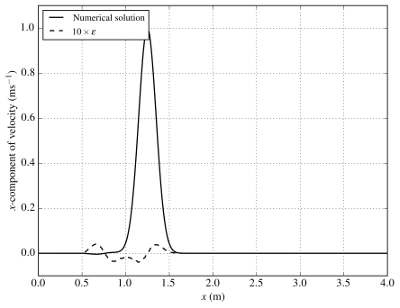
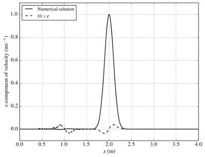

Example: Pulse propagation
==========================

A one-dimensional travelling pulse wave will be considered here as an example of how to set up a simulation in Seigen. This involves a single Python file (``pulse_1d_lf4.py``) which describes the problem to be solved, and can be found in the ``tests/pulse`` directory.

Background
----------

This test case considered the propagation of a smooth wave across 0 :math:`\leq x \leq` 4 m. Not only does this allow one to check that the wave is propagating at the expected velocity, it also demonstrates that the wave does not dissipate over time as a result of the non-dissipative nature of the numerical scheme.

The initial condition for the :math:`x`-component of velocity and :math:`xx`-component of stress are given by

.. math::  \mathbf{u}_x = e^{-50(x-1)^2}

.. math:: \mathbb{T}_{xx} = -e^{-50(x-1)^2}

An absorption region was applied at both ends of the domain (0 :math:`\leq x \leq` 0.5 m and 3.5 :math:`\leq x \leq` 4.0 m), with an absorption coefficient of :math:`\sigma = 100`, to model an infinite domain and to prevent any spurious reflections off the end boundaries.

The physical parameters were set to :math:`\mu` = 0.5 Pa, :math:`\lambda` = 0.25 Pa and :math:`\rho` = 1.0 :math:`\mathrm{kgm}^{-3}`. For discretisation purposes, a structured mesh of characteristic element length :math:`\Delta x` = 0.01 m was used. The time-step :math:`\Delta t` of 0.0025 s was set, corresponding to a maximum Courant number of 0.25, and the solutions were advanced forward in time until :math:`T` = 2.0 s. Both the velocity and stress fields were represented by piecewise-discontinuous linear (also known as P1-DG) polynomials, since this simulation did not require such a high degree of accuracy to demonstrate the robustness of the numerical scheme.

The results in the figures below show how the pulse propagates from left to right, whilst displaying excellent agreement with the analytical solution derived by `Delcourte et al. (2009) <https://doi.org/10.1051/proc/2009020>`_. The :math:`x`-component of the velocity field is shown at :math:`t` = 0.25, 1.0 and 2.0 (from left to right). The pulse wave travels at the correct velocity of 1 :math:`\mathrm{ms}^{-1}`. The difference between the analytical and numerical solution, :math:`\epsilon`, is scaled by a factor of 10 to emphasise the insignificant dissipation over time.

.. image::  ux_2.00.png

Modules
-------

The ``seigen`` and ``firedrake`` modules are the core modules to be imported into a problem description file. This provides access to Firedrake's Unified Form Language (UFL) constructs needed to describe the problem (for example, custom mathematical expressions for the initial conditions), and Seigen's solvers. Parts of the PyOP2, the parallel execution framework, may also be imported; the example here uses the ``timed_region`` function to measure the time taken to generate the computational mesh of solution points (see next subsection).

.. code-block:: python

   from seigen import *
   from firedrake import *
   from pyop2.profiling import timed_region

Mesh
----

The length of the one-dimensional domain is given by ``Lx`` and the characteristic element length is given by ``h``. These are set as constants before being passed to Firedrake's ``IntervalMesh`` class which generates the line of equispaced solution points.

.. code-block:: python

   Lx = 4.0
   h = 1e-2
   with timed_region('mesh generation'):
       mesh = IntervalMesh(int(Lx/h), Lx)
    
Solver
------

The ``ElasticLF4`` class encapsulates the elastic wave equation and the fourth-order leapfrog solution algorithm (denoted LF4). Users should instantiate an ``ElasticLF4`` object and call the ``create`` method, providing the mesh object, specifying whether the solution fields should consider the discontinuous Galerkin (DG) or continuous Galerkin (CG) discretisation, the order of the basis function polynomials (1, or linear basis functions in this case), and the dimension of the problem.

Note that the ``ElasticLF4`` class acts as a base class to the implicit (``ImplicitElasticLF4``) and explicit (``ExplicitElasticLF4``) solvers. An optional keyword argument ``solver`` can be passed to specify which one to use; by default, ``solver="explicit"``.

.. code-block:: python

   elastic = ElasticLF4.create(mesh, "DG", 1, dimension=1)

Constants
~~~~~~~~~

Problem-specific constants such as the Lame parameters and density need to be specified by setting the appropriate solver attributes directly. Seigen comes with several helper functions, such as ``Vp`` and ``Vs`` for calculating the P-wave and S-wave velocities, respectively, from these constants.

The timestep ``dt`` should also be set here. This can either be hardcoded, or set by the ``cfl_dt`` helper function which uses ``Vp`` to compute the maximum permitted value for the timestep with respect to a given CFL condition.

.. code-block:: python

   # Constants
   elastic.density = 1.0
   elastic.dt = 0.0025
   elastic.mu = 0.25
   elastic.l = 0.5

   print("P-wave velocity: %f" % Vp(elastic.mu, elastic.l, elastic.density))
   print("S-wave velocity: %f" % Vs(elastic.mu, elastic.density))
    
Additional terms
~~~~~~~~~~~~~~~~

Additional terms can be added to the solver by setting the ``absorption`` and/or ``source`` attributes with an ``Expresssion`` UFL object. The example here sets up a sponge region near the ends of the domain using a ternary expression. Note that the function space for the absorption term also needs to be specified here; for simplicity this is the same as the velocity and stress fields in this example.

.. code-block:: python

   F = FunctionSpace(elastic.mesh, "DG", 1)
   elastic.absorption_function = Function(F)
   elastic.absorption = Expression("x[0] >= 3.5 || x[0] <= 0.5 ? 100.0 : 0")
   
Initial conditions
------------------

Expressions for velocity and stress at time t = 0 should be provided via the ``u0`` and ``s0`` solver attributes. Again, this uses ``Expresssion`` UFL objects. However, note that these need to be interpolated onto the DG function spaces used by the velocity and stress fields.

.. code-block:: python

   # Initial conditions
   uic = Expression('exp(-50*pow((x[0]-1), 2))')
   elastic.u0.assign(Function(elastic.U).interpolate(uic))
   sic = Expression('-exp(-50*pow((x[0]-1), 2))')
   elastic.s0.assign(Function(elastic.S).interpolate(sic))
 
Execution
---------

Running the model by advancing the equations forward in time is done simply by specifying the end time, T, and calling the ``run`` method of the solver.

.. code-block:: python

   T = 2.0
   elastic.run(T)
   
